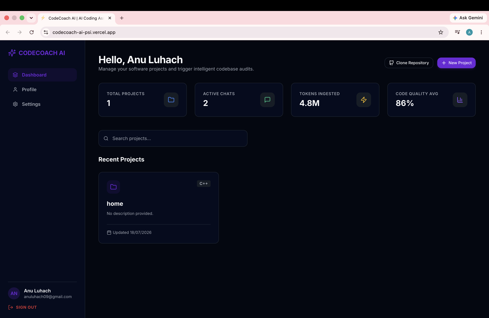

# 🚀 CodeCoach AI – AI-Powered Coding Interview Preparation Platform

  

  <b>AI-Powered Coding Assistant for Intelligent Code Reviews, Repository Analysis, and Interview Preparation</b>

---

## 📖 Overview

CodeCoach AI is a full-stack AI-powered coding interview preparation platform that helps developers improve their programming skills through an interactive coding workspace, AI-powered code reviews, repository analysis, and interview-focused practice.

The platform combines a modern React frontend with a scalable Node.js backend, enabling users to clone GitHub repositories, analyze code quality, receive AI-generated suggestions, and configure different AI models for intelligent software development assistance.

---

## ✨ Features

### 👨‍💻 Coding Workspace

- Interactive online code editor
- Syntax highlighting
- Real-time coding experience
- Clean and responsive UI

### 🤖 AI Coding Assistant

- AI-generated coding hints
- Code explanation
- Bug detection
- Code optimization suggestions
- Interview-focused guidance

### 📂 Project Management

- Clone GitHub repositories
- Create and manage projects
- Repository organization
- Project history tracking

### 📊 AI Code Analysis

- Intelligent repository auditing
- Code quality scoring
- AI-powered recommendations
- Token usage analytics

### ⚙️ AI Configuration

- Multiple AI Provider Support
- Model Selection
- Temperature Control
- Token Limit Configuration
- Streaming Responses

### 🔐 Authentication

- Secure Login & Registration
- JWT Authentication
- Password Encryption
- Protected Routes

### 🎨 User Preferences

- Dark / Light Theme
- Programming Language Preferences
- Profile Management

### 📱 Responsive UI

- Fully Responsive Design
- Modern Dashboard
- Smooth Animations
- Mobile Friendly
